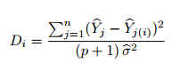

# Readme

<h2 align="center">The homes of King County, a Machine Learning Project</h2>

**Author:** Samuel Middleton

### Business Case:
Real estate is a risky prospect in today's market. With many ups and downs the values of property can change and leave a seller behind and lost in the flux of the market. We are looking to give the seller confidence to sell using mathematical modeling based on statistical learning. These methods can give us insight into what drives the pricing of homes so that we can better assuage the fears of the sellers.

### Framework:

Data Science Frameworks are an invaluable tool for the data science workflow. Workflow is a very common concern in many careers and especially in the programming and computer science fields. Workflows can make the difference in productivity and efficiency, and as the old adage goes 'Time is money'.

We have chosen to use, of the many excellent data science frameworks, the OSEMN framework. This provide us the baseline method for getting to our results, and a way to work through our peoject that provides us with a solid workflow. So what is the OSEMN framework? The handy infographic above lays out the high level view of the process, but we would like to break it down into it's constituent parts to give a more helpful overview. 

- **Obtain** - Source your data that you wish to operate and draw insight from. 
- **Scrub** - Work through your data to remove and fix any glaring issues that will effect modeling quality.
- **Explore** - Find connections and interesting pieces or insights within your data that can be modeled and observed.
- **Model** - Build your mathematical model, be it simple or complex, so that you can either predict future data with or draw inference from.
- **Interpret** - Interpretation is what all of the previous steps have led up to, what information can be drawn from your data to better help in the future.

The OSEMN framework will go a long way in insuring that we are on the right track and working towards a solution for our business case.

### The Data

The data that we are looking over is all home sales for King county between the time period of May 2014 and May 2015. It includes all of the columns with the data described below.

**Column Names and Descriptions**
* **id** - unique identified for a house
* **dateDate** - house was sold
* **pricePrice** - is prediction target
* **bedroomsNumber** - of Bedrooms/House
* **bathroomsNumber** - of bathrooms/bedrooms
* **sqft_livingsquare** - footage of the home
* **sqft_lotsquare** - footage of the lot
* **floorsTotal** - floors (levels) in house
* **waterfront** - House which has a view to a waterfront
* **view** - Has been viewed
* **condition** - How good the condition is ( Overall )
* **grade** - overall grade given to the housing unit, based on King County grading system
* **sqft_above** - square footage of house apart from basement
* **sqft_basement** - square footage of the basement
* **yr_built** - Built Year
* **yr_renovated** - Year when house was renovated
* **zipcode** - zip
* **lat** - Latitude coordinate
* **long** - Longitude coordinate
* **sqft_living15**- The square footage of interior housing living space for the nearest 15 neighbors
* **sqft_lot15** - The square footage of the land lots of the nearest 15 neighbors

### The Methods:

**Linear Regression:** Linear regression is a method in which we model the linear relationship between a dependent variable and one or more independent variables. *This is our main method of modeling on this project.*

**Cook's Distance:** Cook's Distance, or more commonly among statisticians and quants Cook's D, is a Regressional Analysis method on predictor values. 

Cook's Distance returns the weight of data within predictor values. This allows the setting of a threshold at which to drop certain values that are too weighty/influential. Our threshold is set as $D_i = 4/n$ where **n** is the total number of observations. Anything over that threshold we deem too influential and drop from the data.

**Lasso Selection:** least absolute shrinkage and selection operator (LASSO) is a mathod of regressional analyssi that performs regularization and variable selection to increase the accuracy of a machine learning model. This shrinks values towards a central value which can make features 0, thus making it a method of feature selection. This regularization/shrinkage towards a central value is a penalization of weights of independent variables.

### Limitations of our Modeling:

There are certain limitations with this model. These limitations will make it so that the model is not able to predict certain things. The only real major inability for prediction is that it will not fair well within price ranges about $1M. Due to limitations of data and our methodology our prediction strength is not the strongest, but our inference can provide serious insights into the most efficient aspects of our data to provide to future sellers. Therefore we have taken strides to provide inference based data to present in support of our business case. 

However this is not a major detriment as the majority of houses sold in the area are sold below the $1M mark as seen within this map:

This map reveals that a very small portion of our homes are sold at or above $1M.

Total homes sold.

### Interpretation:

#### Grade vs. Price:

We are going to take a look at the relationship that grades play in relation to our pricing data. A big question though is what do these grades mean, and for that information we go to the King County website to further investigate.

[King County Website](https://info.kingcounty.gov/assessor/esales/Glossary.aspx?type=r)

**Grading System**

* **1-3** Falls short of minimum building standards. Normally cabin or inferior structure.

* **4** Generally older, low quality construction. Does not meet code.

* **5** Low construction costs and workmanship. Small, simple design.

* **6** Lowest grade currently meeting building code. Low quality materials and simple designs.

* **7** Average grade of construction and design. Commonly seen in plats and older sub-divisions.

* **8** Just above average in construction and design. Usually better materials in both the exterior and interior finish work.

* **9** Better architectural design with extra interior and exterior design and quality.

* **10** Homes of this quality generally have high quality features. Finish work is better and more design quality is seen in the floor plans. Generally have a larger square footage.

* **11** Custom design and higher quality finish work with added amenities of solid woods, bathroom fixtures and more luxurious options.

* **12** Custom design and excellent builders. All materials are of the highest quality and all conveniences are present.

* **13** Generally custom designed and built. Mansion level. Large amount of highest quality cabinet work, wood trim, marble, entry ways etc.

The relationship between price and grade form a nearly exponential relationship with one another.

#### Zipcode vs. Price:

It is clearly presented by this map that the homes surrounding the inner bay and the coastline are on average more valuable than those in more land-locked areas of the county.

#### Square feet of Living Space Vs. Price:  

The clear relationship between price and square footage of living space is significant until `6800 - 7300`, so it is clear that if one wishes to up the price of their home one should increase the square footage of living space.

### Conclusion:

Our recommendation first and foremost is to increase the grade of your home, which looking at the grading system can be achieved in many ways - such as custom cabinetry or something as simple as installing more luxurious fixtures. Next recommendation for the biggest price increase would be to increase the square footage of the living area in the home into the next bracket. Finally, for an express sale we recommend taking a look at the average price of homes sold in your zipcode and follow those as a guideline to see what price range sells the best for your area. 

Following these guidelines will give you an express sale and will also increase the price at which your home is sold.
